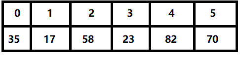
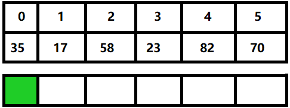
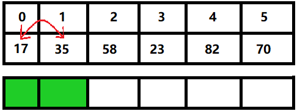
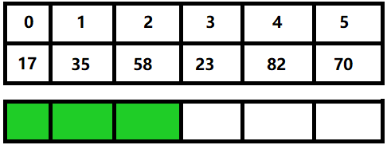
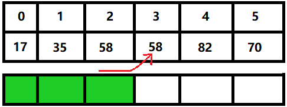
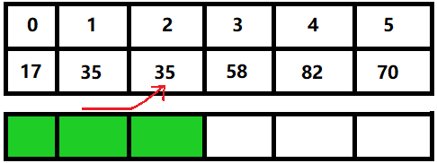
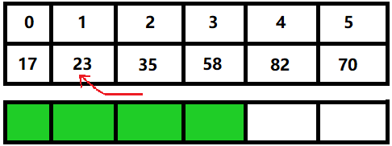
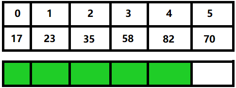
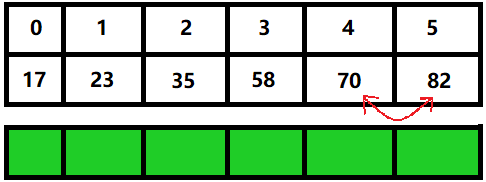

## 概要
本文使用图解的方式介绍了插入排序的概念、原理、实现,通俗易懂,可以作为学习算法的资料.

## 1.什么是插入排序?
显然,插入排序是一种排序方法,它类似打牌时我们摸牌的方式:从无序的牌堆中不断选出一张牌加入牌堆,重复这个过程,就可以得到有序的牌堆了.

## 2.插入排序的具体过程
首先我们定义无序的数组a为: 

其中数组长度n=6.
这里我们引入一个概念:有序区,即数组中有序的部分,现在我们把上图中有序区标上绿色:

到目前为止,没有问题,对吧?毕竟一个元素组成的数组肯定是有序的.
再考虑下标为1的数,现在把它缓存到临时变量temp中,即temp=a[1].
把temp与a[0]（a[1]的前一个元素）进行比较,发现temp<a[0],所以temp应当放在a[0]的左侧,又因为a[0]左侧没有其他元素了,所以数组变为:

现在数组中前两个元素组成的数组是有序的了,所以我们把目光移向第一个无序元素a[2],把它缓存到临时变量temp中,即temp=a[2].
然后我们从右往左遍历有序区,并将每个元素与temp进行比较.可以看出temp比有序区中任一元素都大,所以这一次没有元素变动,并且有序区长度加一:

我们对a[3]也进行同样的操作,但不同的是,这一次需要交换元素:显然a[2]>temp,所以temp需要在a[2]左边,因此a[2]往后移动一位为temp腾出位置,即a[3]=a[2],如下图所示:

到这里大家就可以发现定义临时变量temp的作用了:当元素后移时会覆盖原先的元素,我们定义temp来防止数据的丢失.
但对于原先$a_3$的移动并没有结束,现在我们对temp和a[1]进行比较,发现a[1]>temp,所以a[1]往后移动一位,如下图所示:

继续这个过程,对temp和a[0]进行比较,发现a[0]<temp,所以temp要放在a[0]的右侧,即a[1]处,如下图所示:

这样前四个元素是有序的了.
对于剩下的两个元素,重复上面的步骤即可.



## 3.具体代码实现
~~好,说了这么多,终于要开始写代码了么?!~~
首先,我们定义排序函数,并在其中定义一些基本的变量:
``` cpp
int* insert(int a[], int n) {
// a为待排序数组,n为数组长度,函数返回一个指针(即数组)
    int i, temp;
    // i为有序区长度, temp为临时变量
    // 其他代码
}
```
接下来我们开始写循环部分:
因为每次更新一个元素会使有序区长度加一,且当有序区长度等于总长时循环停止.
所以外层循环如下:
``` cpp
for(i=0; i<n; i++) {
    // 其他代码
}
```
在内部循环中,我们要定义一个变量$j$用于记录当前比较对象的位置,代码如下:
``` cpp
int j=i; // 当前比较对象的位置
temp=a[j+1];
while(j>=0 && temp<a[j])
    a[j+1]=a[j], j--; //当前比较对象向右移一位
a[j+1]=temp;
```
这样就完成了!
最后贴上完整代码:
``` cpp
#include <iostream>
using namespace std;

int* insert(int a[], int n) {
// a为待排序数组,n为数组长度,函数返回一个指针(即数组)
	int i, temp;
	// i为有序区长度, temp为临时变量
	for(i=0; i<n; i++) {
		int j=i; // 当前比较对象的位置
		temp=a[j+1];
		while(j>=0 && temp<a[j])
			a[j+1]=a[j], j--; // 当前比较对象向右移一位
		a[j+1]=temp; // 确定临时变量位置
	}
	return a;
}

int main() {
	/*输入部分*/
	int n, *arr;
	cin>>n;
	arr = new int[n];
	for(int i=0; i<n; i++) cin>>arr[i];
	
	/*处理部分*/
	arr=insert(arr, n);
	
	/*输出部分*/
	for(int i=0; i<n; i++) cout<<arr[i]<<" ";
	cout<<endl;
	return 0;
}
```

## 4.插入排序的性质
停停停,先别走,我们还有最后一个问题: 插入排序到底好不好? 下面是对这种算法的一个分析
#### 1.稳定性
插入排序是**稳定的**,即有a[i],a[j]两个元素,排序前a[i]=a[j]且i<j,则排序后任有i<j.
#### 2.性能
插入排序最优时间复杂度为O(n),最坏时间复杂度为O(n<sup>2</sup>),平均时间复杂度也为O(n<sup>2</sup>).
与之相对的,插入排序的空间复杂度仅为O(1),因为代码中只有常数个变量
#### 3.应用场景
待排序元素较少,大部分元素有序的情况下,插入排序性能较好

##
这篇文章就到这里了,各位下次见!